# ACAMS – Animal Care & Adoption Management System

ACAMS is a full-stack web application for managing animals, users, and adoption requests in a shelter environment. It supports separate roles for **Adopters** and **Staff**, with role-based access control across the system.

## Screenshots

### Authentication

| Login | Sign Up |
|---|---|
| 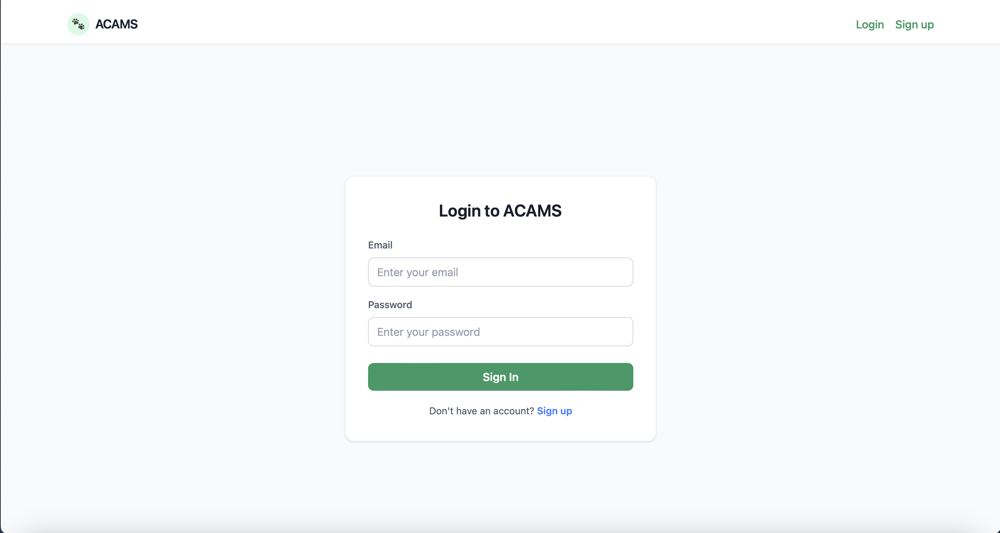 | 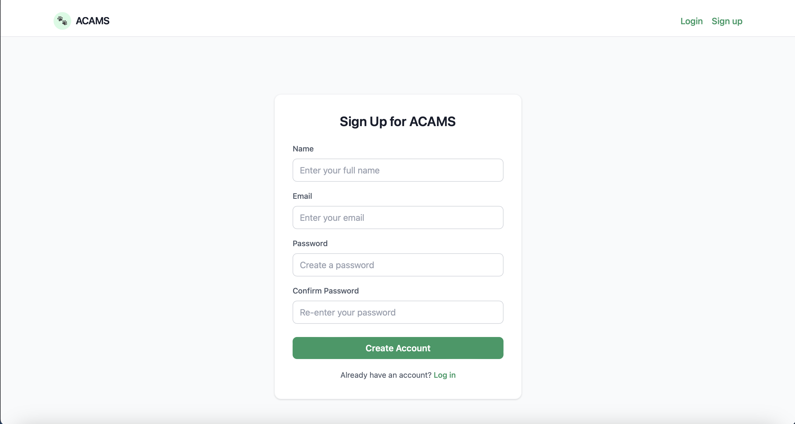 |

### Staff Dashboard

| Adoption Requests | Request Status Workflow |
|---|---|
| 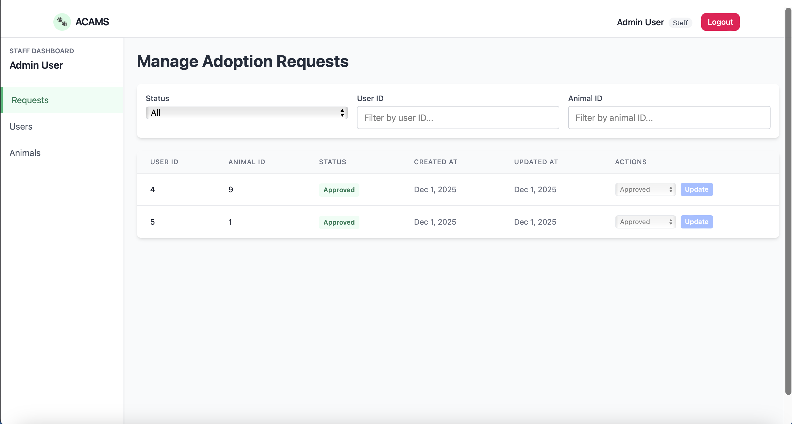 | 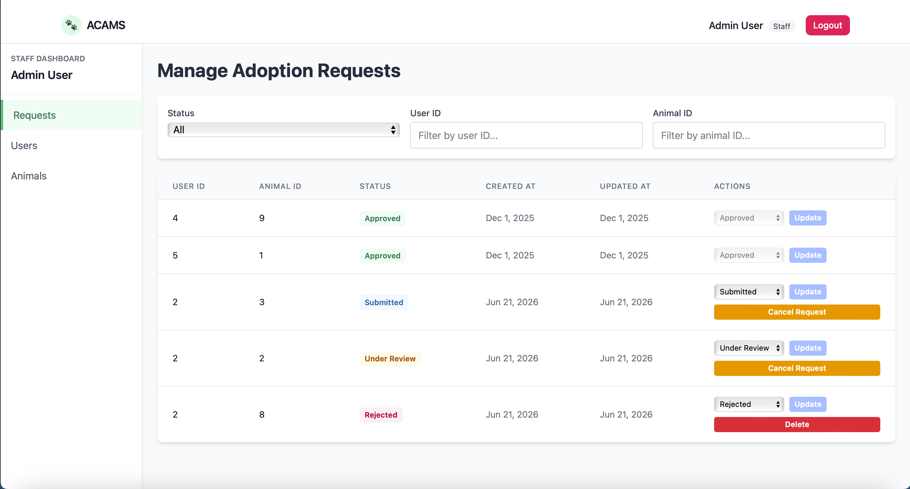 |

| Users | Animals |
|---|---|
| 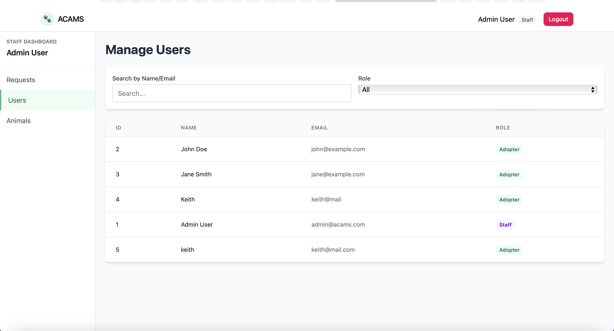 | 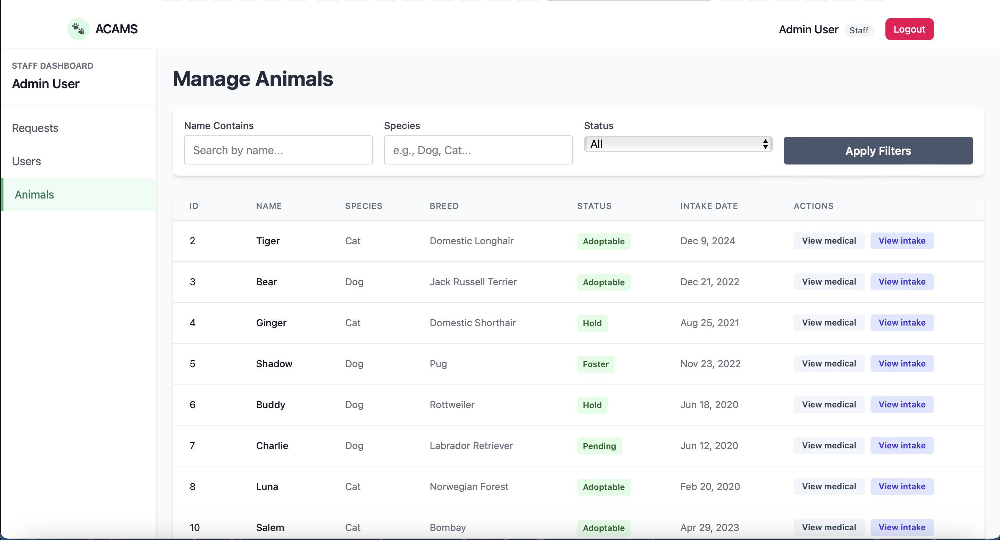 |

| Medical Records | Intake Records |
|---|---|
| 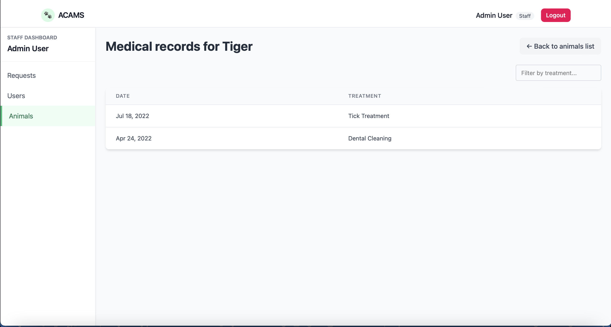 | 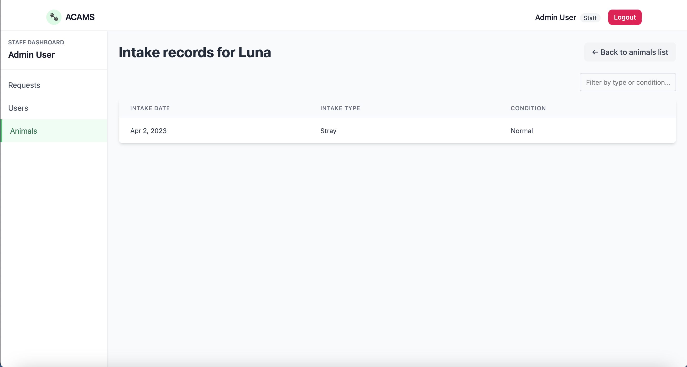 |

### Adopter Dashboard

| Browse Animals | Submitted Requests |
|---|---|
| 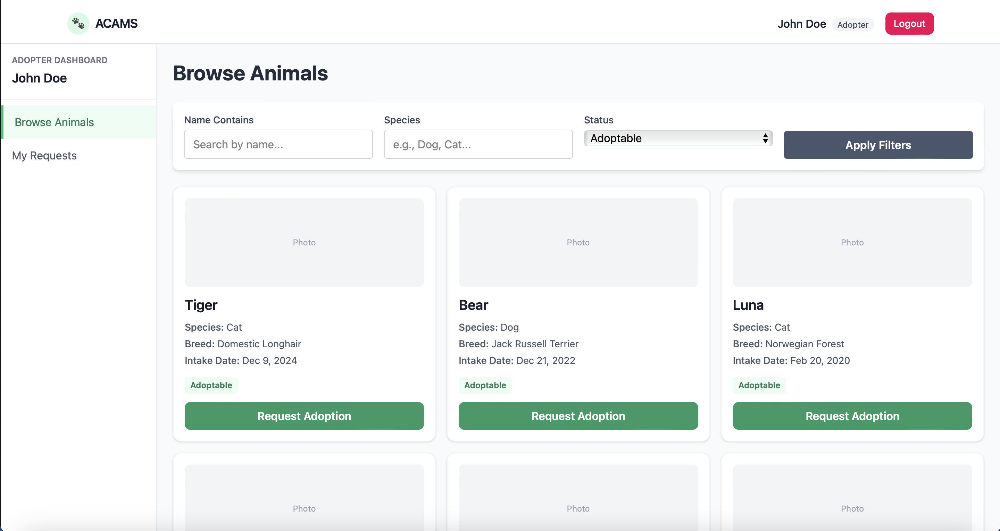 | 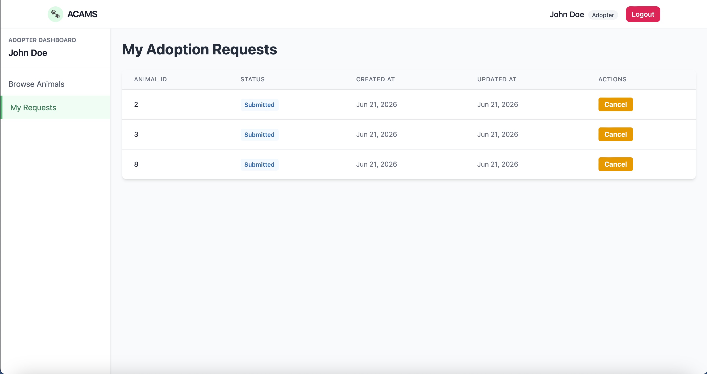 |

| Request Statuses |
|---|
| 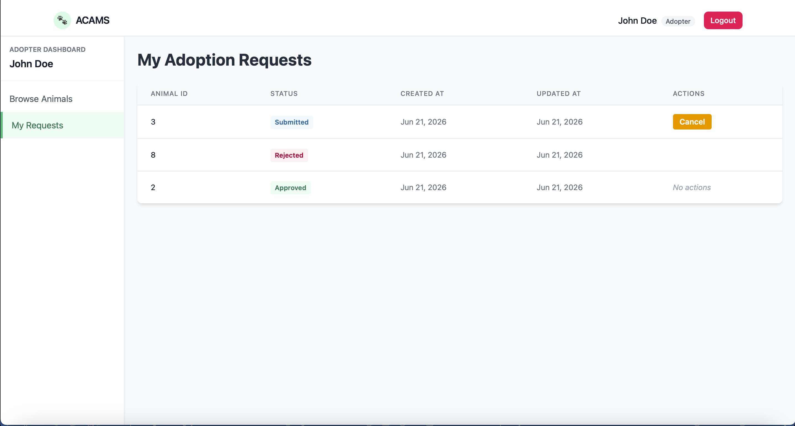 |

## Project Structure

```
.
├── README.md  
├── backend  
│   ├── Dockerfile  
│   ├── requirements.txt  
│   └── app  
│       ├── main.py          # FastAPI entry point (raw SQL API)  
│       ├── models.py        # SQLAlchemy models & enums  
│       ├── schemas.py       # Pydantic request/response schemas  
│       ├── db.py            # Database connection  
│       ├── deps.py          # DB dependency injection  
│       └── core  
│           └── config.py    # App configuration  
├── db  
│   ├── create_tables.sql   # Database schema (PostgreSQL)  
│   └── seed_data.sql       # Initial seed data  
├── docker-compose.yml     # Multi-container setup (backend, db, frontend)  
└── frontend  
    ├── Dockerfile  
    ├── package.json  
    ├── postcss.config.js  
    ├── tailwind.config.js  
    ├── vite.config.ts  
    ├── index.html  
    └── src  
        ├── main.tsx        # React entry point  
        ├── App.tsx         # Top-level routing & layout  
        ├── index.css       # Tailwind base styles  
        ├── context  
        │   └── AuthContext.tsx  
        ├── components  
        │   └── ProtectedRoute.tsx  
        ├── pages  
        │   ├── LoginPage.tsx  
        │   ├── SignupPage.tsx  
        │   ├── AdopterDashboard.tsx  
        │   └── StaffDashboard.tsx  
        └── types  
            ├── auth.ts  
            └── api.ts  

```
## Tech Stack

### Frontend
- React (Vite)
- TypeScript
- Tailwind CSS
- React Router
- Context API for authentication state

### Backend
- FastAPI (Python)
- Raw SQL via SQLAlchemy `text()`
- PostgreSQL
- Pydantic for request/response validation
- bcrypt for password hashing

### DevOps
- Docker
- Docker Compose
- Nginx (frontend container)

## Core Features

### Adopter Features
- Sign up and login
- View all adoptable animals
- Search animals by name, species, and status
- Submit adoption requests
- View own adoption requests
- Cancel adoption requests (only while in Submitted or Under Review status)

### Staff Features
- Login with Staff role
- View all adoption requests
- Update adoption request status:
  - Submitted → Under Review / Approved / Rejected / Cancelled
  - Under Review → Approved / Rejected / Cancelled
- When a request is approved:
  - The animal is marked as Adopted
  - All other active requests for the same animal are automatically cancelled
- Delete adoption requests only if status is Rejected or Cancelled
- View all users
- Filter users by role (Staff / Adopter)

### Authentication & Authorization
- Passwords are stored using bcrypt hashing
- Legacy plaintext passwords are automatically migrated to bcrypt on first login
- Role-based route protection on frontend:
  - Adopter → `/adopter`
  - Staff → `/staff`
- Backend enforces role checks for all staff-only actions

## Run with Docker (Recommended)

### 1. Prerequisites

- Docker (Docker Desktop on Windows/macOS)
- Docker Compose v2+
- Free ports:
  - 5432 (PostgreSQL)
  - 8000 (Backend API)
  - Frontend port from docker-compose
- Terminal access (PowerShell, Terminal, etc.)

### 2. Build & Start All Services

From the project root (where `docker-compose.yml` is located), run:

```bash
docker compose up --build
```

### 3. Access the App

Once all containers are running:

- Frontend: http://localhost:5173  
- Backend API: http://localhost:8000/docs  

Make sure Docker is still running while accessing the app.
